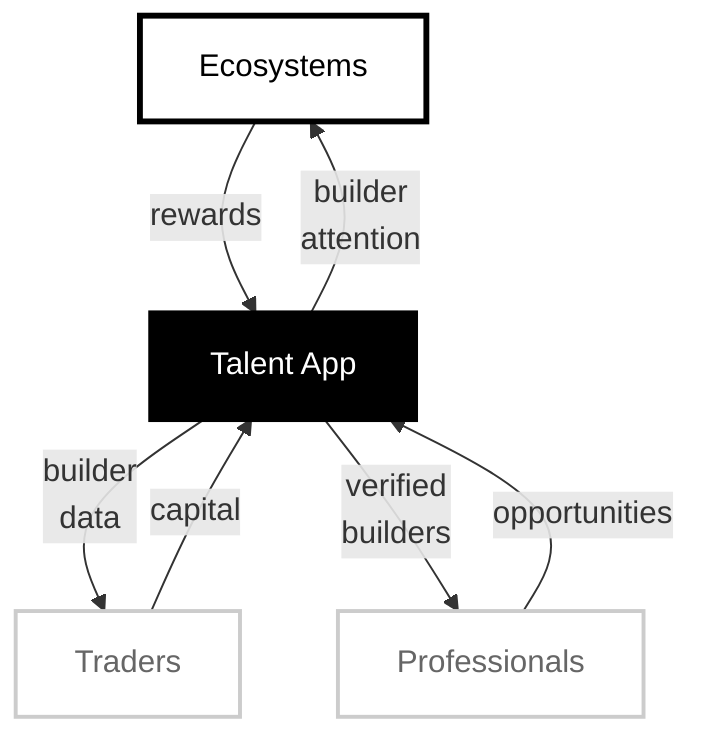

# Talent Protocol - Ecosystem Flow

## Flow Description

### 1. Central Hub: Talent App
- Aggregates builder reputation data and facilitates flows between all participants.

### 3. Ecosystems
- **Input**: Builder attention (discovery, engagement)
- **Output**: Rewards to builders via Talent App

### 3. Traders
- **Input**: Capital investment
- **Output**: Access to aggreagated builder data for conviction

### 4. Professionals
- **Input**: Curation of verified builders
- **Output**: Opportunities (jobs, contracts, partnerships)
