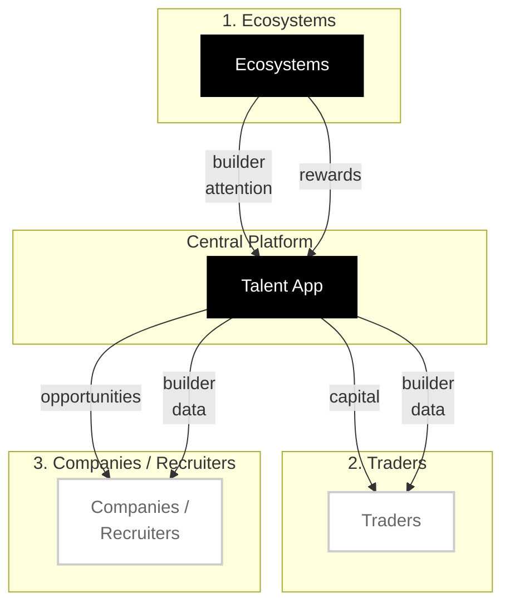

# Talent Protocol - Ecosystem Flow

## Flow Description

### 1. Ecosystems
- **Input**: Builder attention (discovery, engagement)
- **Output**: Rewards to builders via Talent App

### 2. Traders
- **Input**: Capital investment
- **Output**: Access to builder data for conviction

### 3. Companies / Recruiters
- **Input**: Builder data access
- **Output**: Opportunities (jobs, contracts, partnerships)

### Central Hub: Talent App
The platform aggregates builder reputation data and facilitates flows between all participants.
